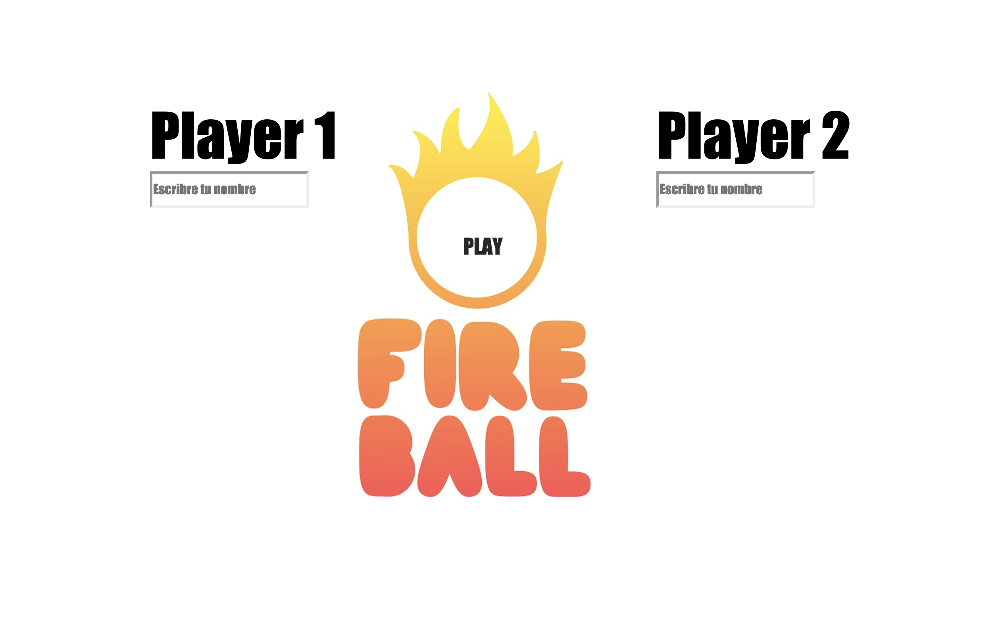
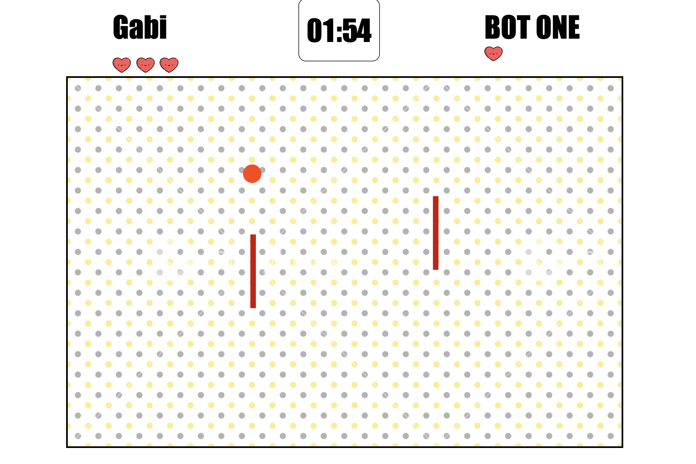
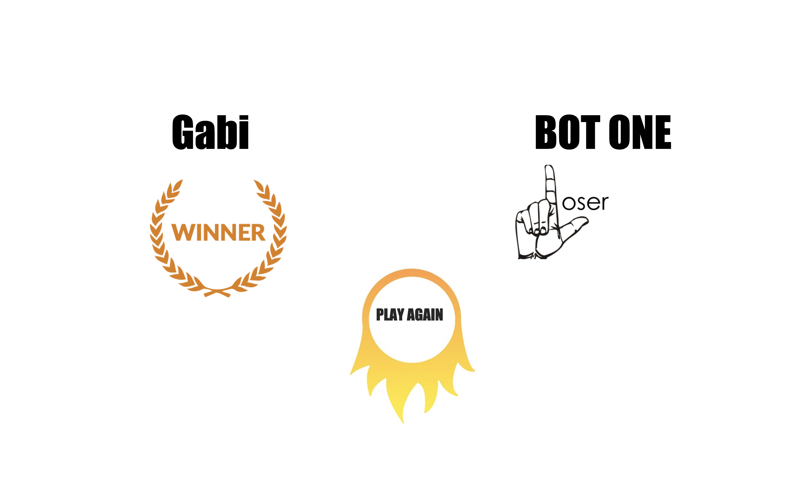

# Fireball
Primer proyecto Ironhack | Fireball

Se trata de un juego multijugador, el cual imital mitico juego Pong pero con una variante, en vez de intentar que la pelota sobrepase a tu rival, tendras que esquivarla y evitar que te de. La pelota atravesara las paredes y saldra por el lado contrario aumentando la velocidad segun vaya pasando el tiempo.

Se tienen 3 vidas, se piede una vida cada vez que la pelota impacta en tu barra y pierde el primero que llegue a 0.

Instrucciones:

En la primera pantalla se debe elegir el nombre de los jugadores:

Despues se desarrolla el juego:

Resultado del juego y jugar otra vez:

